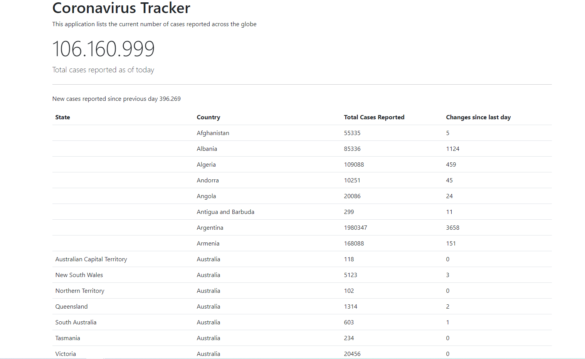

### Coronavirus tracker

This will a web app that tracks all Covid cases around the world. Done with Spring Boot as an introduction to the Spring Framework. I use Bootstrap for styling.

Datasource: https://github.com/CSSEGISandData/COVID-19

